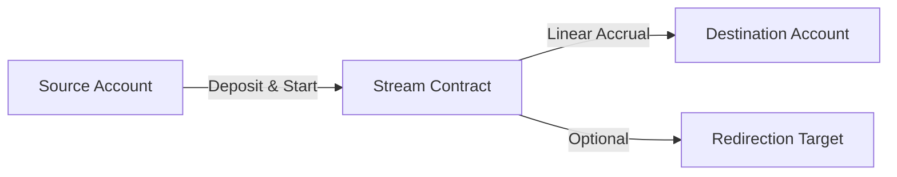

# Cosmic Streams Contracts

On-chain stream orchestration logic for the **Cosmic Streams** ecosystem, built on **Stellar Soroban**.

## Overview

Cosmic Streams enables seamless, real-time value flow between accounts. These contracts manage the locking, distribution, and redirection of assets (Star-Dust) based on time and stream parameters.

### Key Features

- **Linear Streaming**: Assets flow from source to destination at a constant rate per ledger.
- **Dynamic Redirection**: Streams can be split or redirected without withdrawing funds first.
- **Permissionless Setup**: Anyone can initialize a stream for any Stellar asset.

## Architecture



## Getting Started

### Prerequisites

- [Rust Toolchain](https://www.rust-lang.org/tools/install)
- [Soroban CLI](https://soroban.stellar.org/docs/getting-started/setup#install-the-soroban-cli)

### Build & Test

```bash
make build
make test
```

## Deployment

1. **Build**: `make build`
2. **Install**: `soroban contract install --network testnet --wasm target/wasm32-unknown-unknown/release/stream_contract.wasm`
3. **Deploy**: `soroban contract deploy --wasm-hash <HASH> --network testnet`

## License

This project is licensed under the MIT License - see the [LICENSE](LICENSE) file for details.
